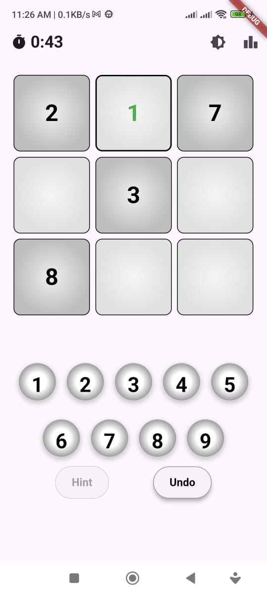
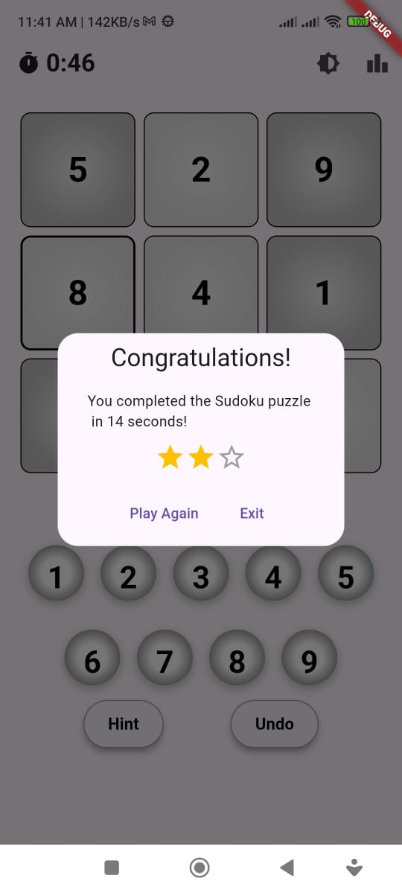
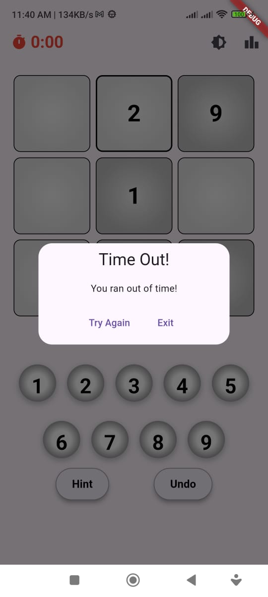
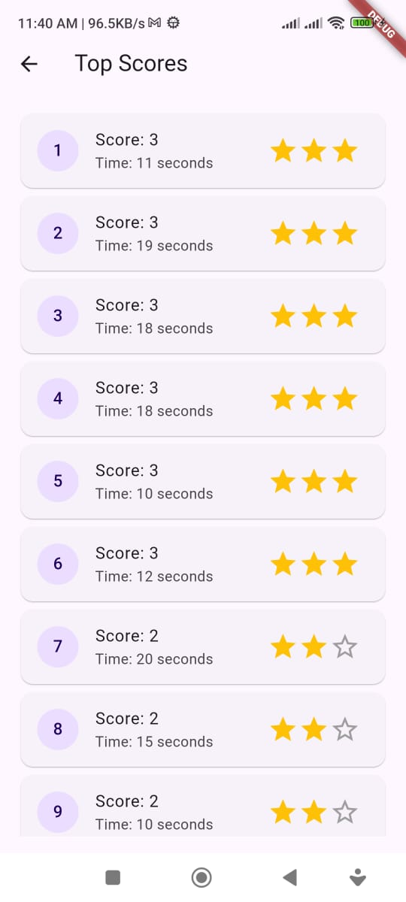
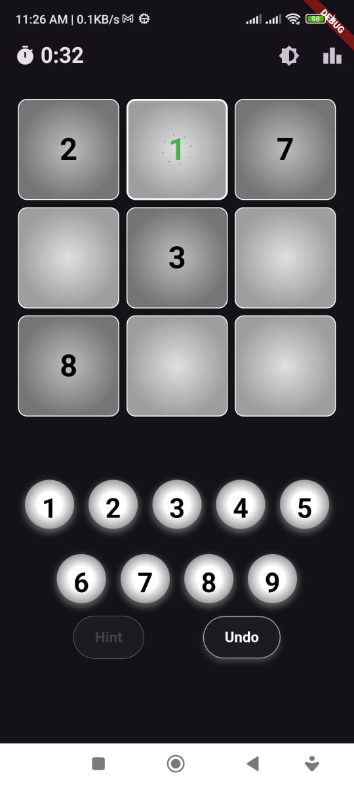
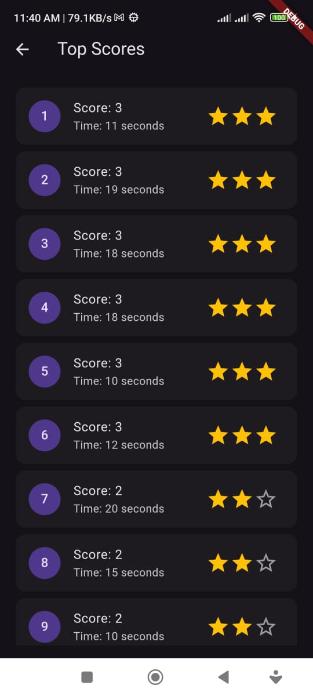

# 3x3 Sudoku Game Competition

Welcome to the 3x3 Sudoku Game Competition! This is a simple and fun Sudoku game built using Flutter and the GetX state management library.

## Table of Contents

- [Introduction](#introduction)
- [Features](#features)
- [Screenshots](#screenshots)
- [Installation](#installation)


## Introduction

This 3x3 Sudoku game is designed to provide a quick and enjoyable puzzle experience. The game is built using Flutter, making it cross-platform and easy to play on both Android and iOS devices. The GetX library is used for state management, ensuring a smooth and responsive user interface.

## Features

- Simple and intuitive 3x3 Sudoku gameplay
- Clean and user-friendly interface
- Responsive design for various screen sizes
- Efficient state management using GetX
- Real-time game updates

## Screenshots








## Installation

To get started with the 3x3 Sudoku Game, follow these steps:

1. **Clone the repository:**

   ```bash
   git clone https://github.com/Fathialfadel/3x3-Sudoku-game-competition.git
   cd 3x3-Sudoku-game-competition
